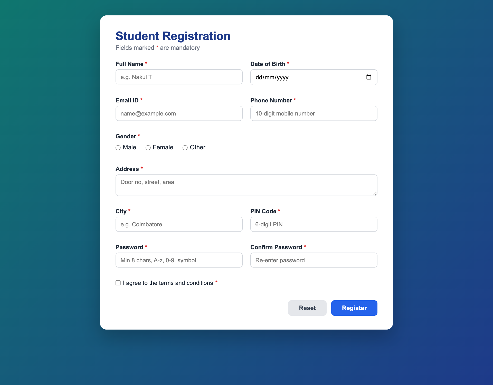
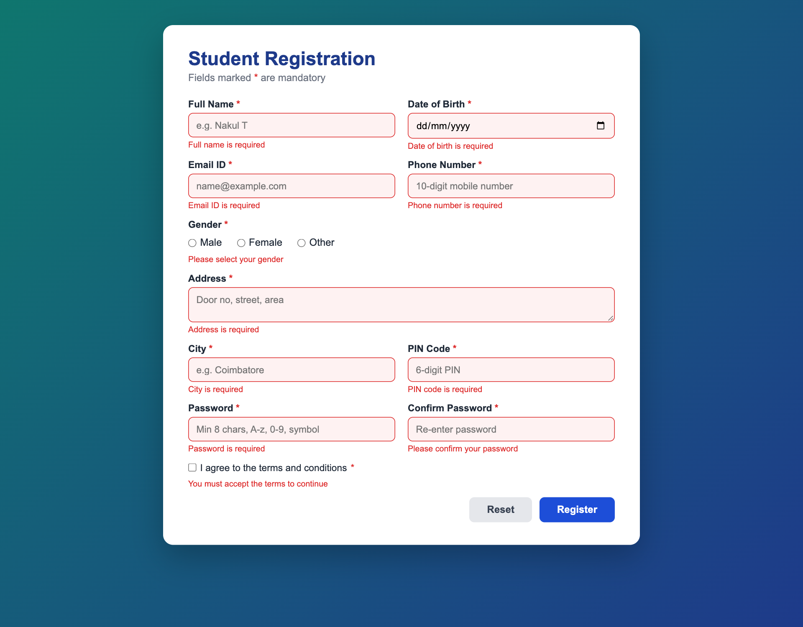
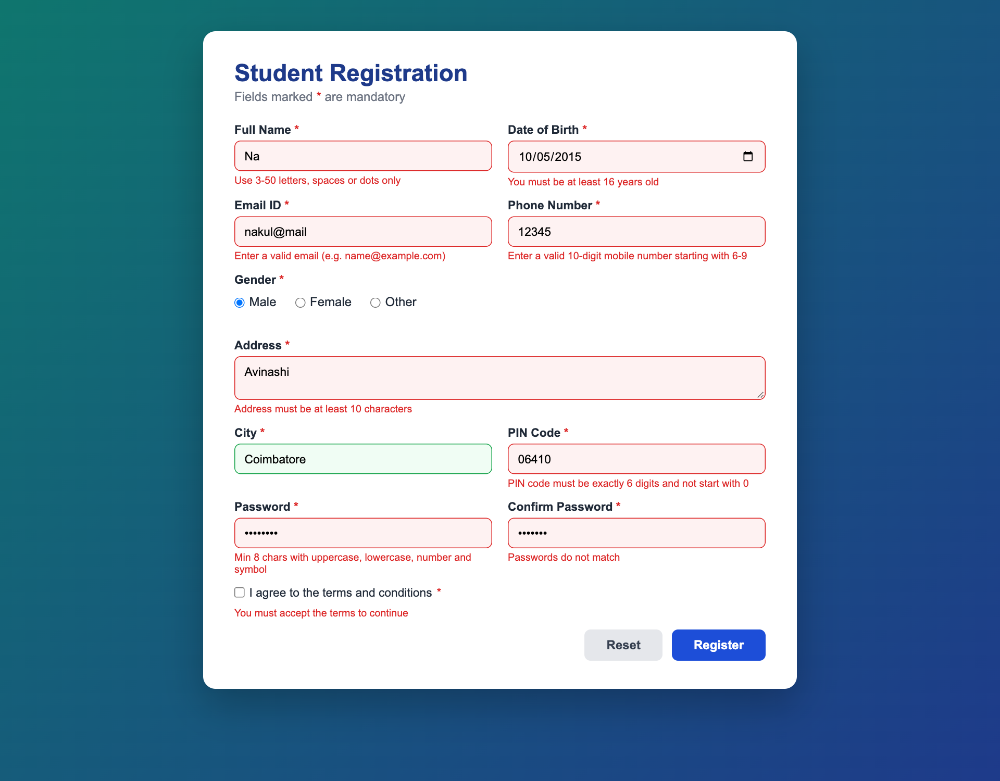
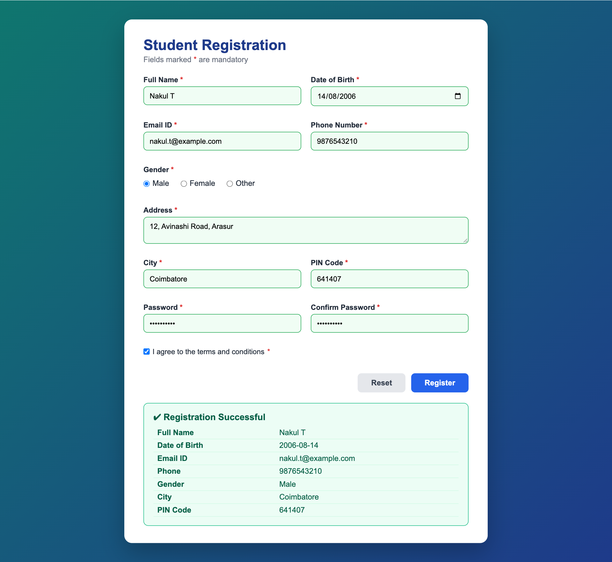

# Website with Client-Side Form Validation

> **Application Development Laboratory (U21AD502) — Experiment 02**
> Prepared by **Nakul T (24AD068)**, Department of Artificial Intelligence and Data Science, KPR Institute of Engineering and Technology.

## Project Overview

A student registration website whose form is validated entirely in the browser using JavaScript. Every field is mandatory and is checked for the correct format (name, date of birth, email ID, phone number, address, city, PIN code, password strength and password confirmation) before the form is allowed to submit.

**Aim:** To develop a website where a user can register his/her details using a form. The client-side scripting should validate the details entered by the user, e.g. email ID, phone number, PIN code number, etc. It should also have mandatory fields which cannot be empty.

## Features

- Mandatory field checks with a clear error message under each field
- Format validation using regular expressions for name, email, 10-digit Indian mobile number and 6-digit PIN code
- Age check from date of birth (minimum 16 years)
- Strong password rule (8+ characters with uppercase, lowercase, digit and symbol) and confirm-password match
- Live validation on blur and while typing, with red/green field highlighting
- Digits-only filtering for phone and PIN code inputs
- preventDefault() blocks submission until all rules pass; success summary is shown afterwards
- Reset button clears values, errors and highlighting

## Tech Stack

| Layer | Technology |
|---|---|
| Markup | HTML5 forms |
| Styling | CSS3 (Grid, transitions) |
| Logic | Vanilla JavaScript (DOM API, regular expressions, FormData) |
| Tools | VS Code, Google Chrome DevTools |

## Folder Structure

```
exp02-form-validation-website/
├── .gitignore
├── LICENSE
├── README.md
├── css/
│   └── style.css
├── index.html
├── js/
│   └── validation.js
└── screenshots/   (output screenshots)
```

## Setup and Installation

1. Clone the repository: `git clone https://github.com/nakultt/exp02-form-validation-website.git`
2. Open the folder: `cd exp02-form-validation-website`
3. No dependencies are required.

## How to Run

Open `index.html` in a browser (or run `npx serve .`). Try submitting the empty form, then invalid values, then valid values to see each validation rule in action.

## Screenshots

### 1. Registration form with mandatory fields



### 2. Errors shown when the form is submitted empty



### 3. Format errors for invalid name, email, phone, PIN code and password



### 4. All fields valid – registration successful with summary



## Result

The project was successfully developed and executed, and the output was verified.

## Author

**Nakul T** — 24AD068 · B.Tech Artificial Intelligence and Data Science · [github.com/nakultt](https://github.com/nakultt)
